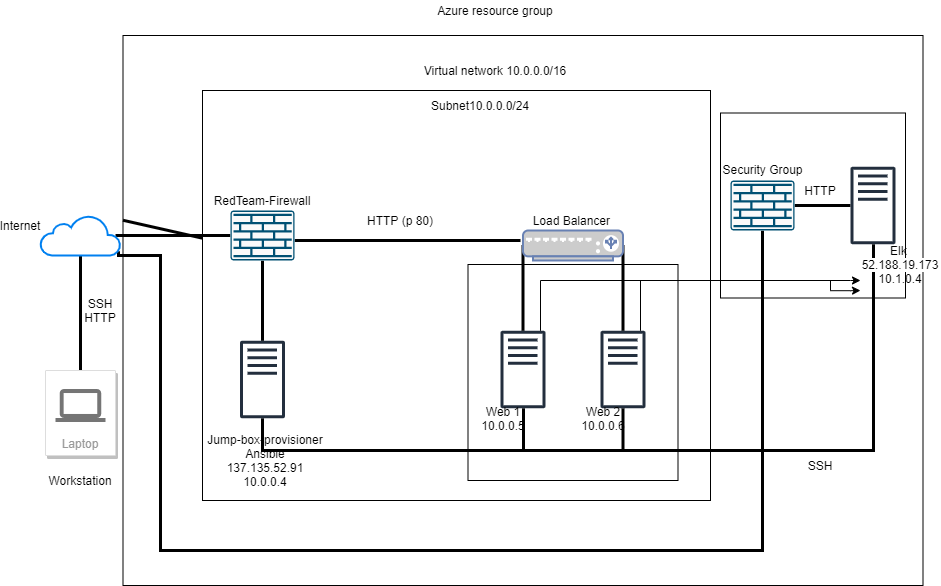
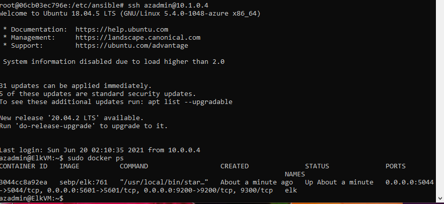
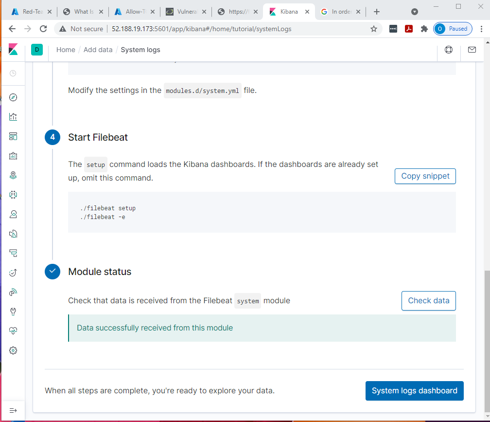
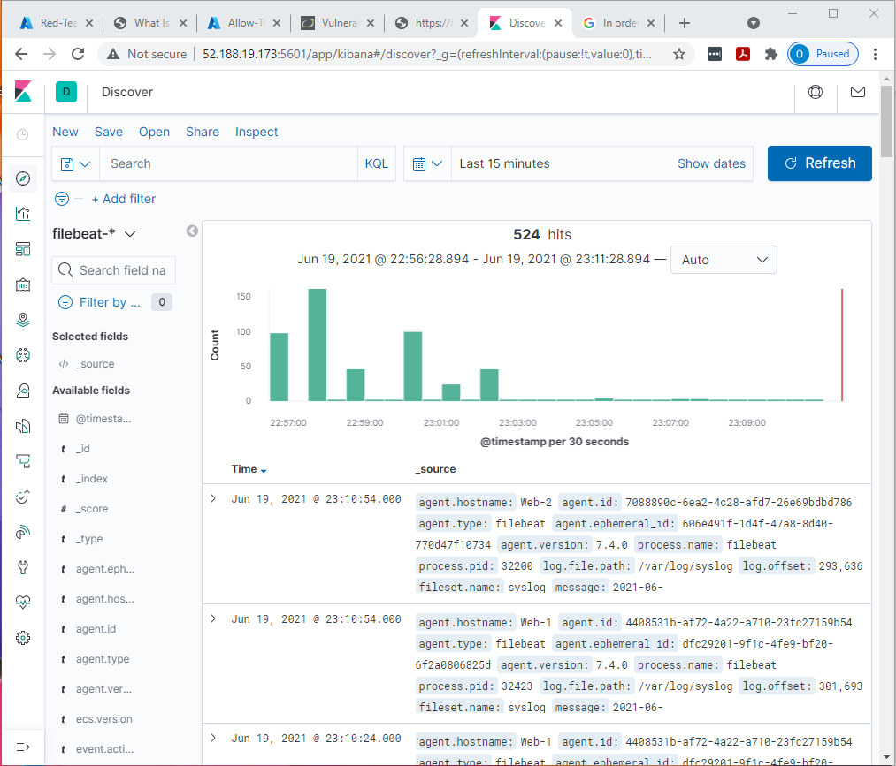
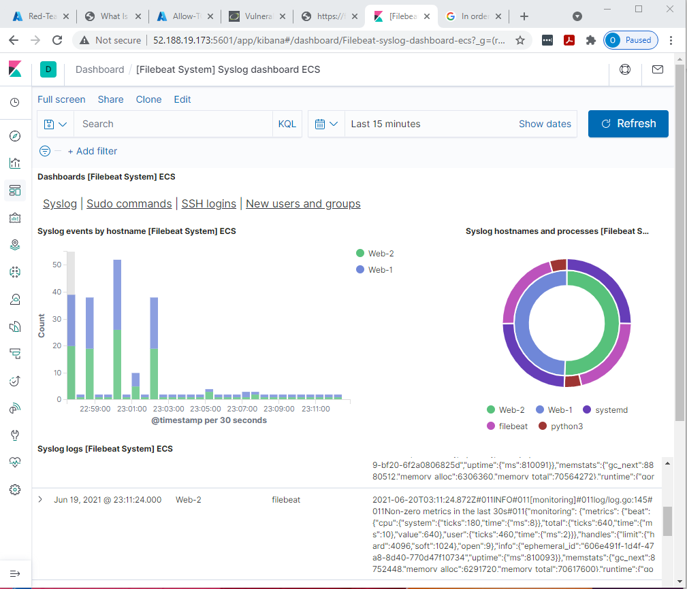

# Cybersecurity_Project1
Elk/Github Fundamentals
## Automated ELK Stack Deployment

The files in this repository were used to configure the network depicted below.
 

These files have been tested and used to generate a live ELK deployment on Azure. They can be used to either recreate the entire deployment pictured above. Alternatively, select portions of the YML file may be used to install only certain pieces of it, such as Filebeat.

  - [install-elk](https://github.com/oflore12/Cybersecurity_Project1/blob/main/Ansible/install-elk.yml)
  - [filebeat-playbook](https://github.com/oflore12/Cybersecurity_Project1/blob/main/Ansible/filebeat-playbook.yml)
  - [metricbeat-playbook](https://github.com/oflore12/Cybersecurity_Project1/blob/main/Ansible/metricbeat-playbook.yml)

This document contains the following details:
- Description of the Topologu
- Access Policies
- ELK Configuration
  - Beats in Use
  - Machines Being Monitored
- How to Use the Ansible Build

### Description of the Topology

The main purpose of this network is to expose a load-balanced and monitored instance of DVWA, the D*mn Vulnerable Web Application.

Load balancing ensures that the application will be highly efficient, in addition to restricting DoS attacks to the network.
- What aspect of security do load balancers protect? What is the advantage of a jump box?
- The load balancer protects the availability aspect of security as it ensures that traffic is distributed across multiple servers and it can mitigate DoS attacks. The advantage of having a jump box is that their is an added layer of security for anyone trying to access the servers directly. Also it allows for easier manipulation of servers, configuration of all servers can be done from the jumpbox.

Integrating an ELK server allows users to easily monitor the vulnerable VMs for changes to the jumpbox and system networks.
- What does Filebeat watch for? Data about the file system
- What does Metricbeat record? machine metrics

The configuration details of each machine may be found below.
_Note: Use the [Markdown Table Generator](http://www.tablesgenerator.com/markdown_tables) to add/remove values from the table_.

| Name     | Function  | IP Address | Operating System |
|----------|-----------|------------|------------------|
| Jump Box | Gateway   | 10.0.0.4   | Linux            |
| Web-1    | Server    | 10.0.0.5   | Linux            |
| Web-2    | Server    | 10.0.0.6   | Linux            |
| ElkVM    |Log Server | 10.1.0.4   | Linux            |

### Access Policies

The machines on the internal network are not exposed to the public Internet. 

Only the ElkVM machine can accept connections from the Internet. Access to this machine is only allowed from the following IP addresses:
- 73.212.151.158

Machines within the network can only be accessed by the jump-box-provisioner.
- Which machine did you allow to access your ELK VM? What was its IP address? Private work station and jump box, 73.212.151.158, 10.0.0.4

A summary of the access policies in place can be found in the table below.

| Name     | Publicly Accessible | Allowed IP Addresses    |
|----------|---------------------|-------------------------|
| Jump Box | Yes                 | 73.212.151.158          |
| Web-1    | No                  | 10.0.0.4                |
| Web-2    | No                  | 10.0.0.4                |
| ElkVM    | Yes                 | 73.212.151.158,10.0.0.4 |
|Load Balancer| Yes              | Any                     |

### Elk Configuration

Ansible was used to automate configuration of the ELK machine. No configuration was performed manually, which is advantageous because...
- What is the main advantage of automating configuration with Ansible? Main advantage is the flexibiliy behind it. A playbook can be customized based the needs of the server.

The playbook implements the following tasks:
- install docker
- install python3-pip
- install docker modules
- increase virtual memoy
- use more memory
- download and launch docker elk container
- enable service on boot

The following screenshot displays the result of running `docker ps` after successfully configuring the ELK instance.

**Note**: The following image link needs to be updated. Replace `docker_ps_output.png` with the name of your screenshot image file.  

### Target Machines & Beats
This ELK server is configured to monitor the following machines:
- List the IP addresses of the machines you are monitoring
- 10.0.0.5
- 10.0.0.6

We have installed the following Beats on these machines:
- Specify which Beats you successfully installed_
- filebeat
- metricbeat

These Beats allow us to collect the following information from each machine:
- In 1-2 sentences, explain what kind of data each beat collects, and provide 1 example of what you expect to see. E.g., `Winlogbeat` collects Windows logs, which we use to track user logon events, etc._
- Filebeat and metricbeat both collect data from the web servers created. Filebeat will log information of the file system, specially which files have been changed and when. Metricbeat collects metrics from the system and the services running on each server.

### Using the Playbook
In order to use the playbook, you will need to have an Ansible control node already configured. Assuming you have such a control node provisioned: 

SSH into the control node and follow the steps below:
- Copy the filebeat-config.yml file to files directory.
- Update the filebeat-config.yml file to include the IP adress of the Elk VM
- Run the playbook, and navigate to kibana to check that the installation worked as expected.

_ Answer the following questions to fill in the blanks:_
- Which file is the playbook? Where do you copy it? /etc/ansible/files/filebeat-config.yml, it gets copied to the /etc/filebeat/filebeat.yml
- Which file do you update to make Ansible run the playbook on a specific machine? How do I specify which machine to install the ELK server on versus which to install Filebeat on? You run filebeat-playbook.yml to run Ansible on a specific machine, you specify the machine to install the playbook at the begining of YML document by specify the 'hosts'. Adding 'webservers' will install in the web-1 and web-2 servers and adding 'elk' will install on elk machine. In order to add group you have to edit the hosts file and add IP address to the machine that belongs in the group.
- Which URL do you navigate to in order to check that the ELK server is running? http://[ELK MACHINE PUBLIC IP ADDRESS]/app/kibana http://52.188.19.173:5601/app/kibana  

_As a **Bonus**, provide the specific commands the user will need to run to download the playbook, update the files, etc._
- curl https://gist.githubusercontent.com/slape/5cc350109583af6cbe577bbcc0710c93/raw/eca603b72586fbe148c11f9c87bf96a63cb25760/Filebeat > filebeat-config.yml
- nano filebeat-config.yml
- update to include ELK server IP on line #1106 and #1806

output.elasticsearch:
hosts: ["10.1.0.4:9200"] <----- change line #1106

username: "elastic"

password: "changeme"

setup.kibana:

host: "10.1.0.4:5601" <----- change line #1806

- nano filebeat-playbook.yml (should be in the files directory)
- [Use this yml file to create play book](https://github.com/oflore12/Cybersecurity_Project1/blob/main/Ansible/filebeat-playbook.yml)
- save file
- run 'ansible-playbook filebeat-playbook.yml
-
-
-
-
-

Steps can be repeated for metricbeat the url to use for curl command is 'https://gist.githubusercontent.com/slape/58541585cc1886d2e26cd8be557ce04c/raw/0ce2c7e744c54513616966affb5e9d96f5e12f73/metricbeat'
